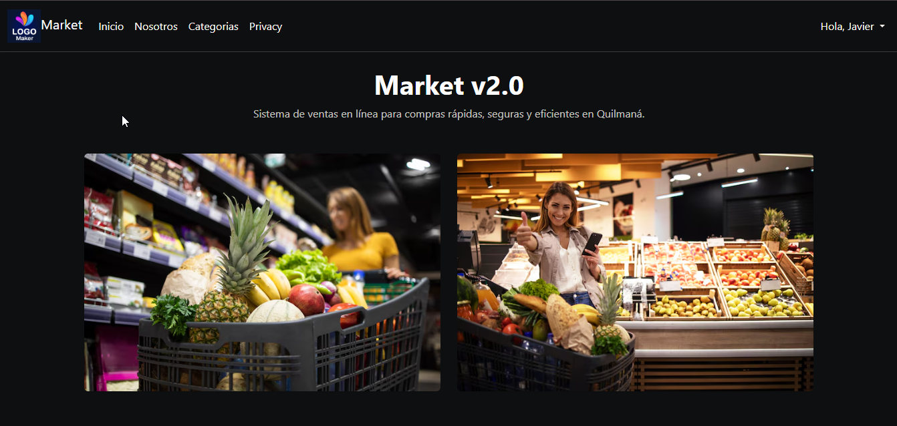

# Market V2 🛒

Sistema web desarrollado con **ASP.NET Core** y **MySQL**, orientado a la gestión de usuarios con una arquitectura preparada para escalar.

---

## 🧩 Descripción

Market V2 es una aplicación web en etapa inicial que implementa autenticación de usuarios, manejo de sesiones y una base de datos normalizada para soportar crecimiento por ubicación geográfica y roles.

El sistema está pensado para evolucionar hacia un entorno comercial o corporativo.

---

## 🛠️ Stack Tecnológico

- ASP.NET Core MVC
- .NET 9 / 10
- Entity Framework Core
- MySQL
- Bootstrap
- Bootstrap Icons
- C#

---

## 🔐 Seguridad

- Autenticación por correo y contraseña
- Contraseñas cifradas con **SHA-256**
- Manejo de sesión mediante `HttpContext.Session`
- Control de estado de usuario (`status`)

---

## 🗄️ Modelo de Datos

Entidad principal: **personas**

Campos clave:

- Identificación del usuario
- Datos personales
- Rol del usuario
- Dirección y distrito
- Estado del registro
- Fecha de creación

La estructura permite extenderse por **distrito, provincia y departamento** sin rediseñar el sistema.

---

## 📌 Estado Actual

- ✔ Estructura base del sistema
- ✔ Login funcional
- ✔ Manejo de sesiones
- ✔ Diseño inicial de interfaz
- ⏳ Módulos en expansión
